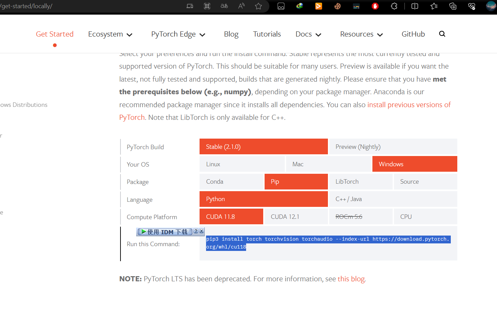

# Bert_vits2
- [Bert_vits2](https://github.com/fishaudio/Bert-VITS2)
- [获取更多模型](https://www.bilibili.com/read/cv26912729/?jump_opus=1)
# 部署
**请确保已经安装[python3.9.0](https://github.com/avilliai/wReply/releases/tag/yirimirai-Bot) ，由于使用了非此版本的py解释器部署此项目产生的报错请自行搜索解决。**<br>
## 1、源码部署
#### 1.1克隆仓库到本地
找一个你喜欢的目录，打开cmd执行
```
git clone https://github.com/avilliai/Bert_Vits2_Sever.git
```
#### 1.2下载必要文件
从[Huggingface](https://huggingface.co/spaces/XzJosh/Azusa-Bert-VITS2/tree/main/bert/chinese-roberta-wwm-ext-large) **下载如下三个文件并放入bert/chinese-roberta-wwm-ext-large文件夹**
- flax_model.msgpack
- pytorch_model.bin
- tf_model.h5<br>
#### 1.3获取模型
[获取模型](https://www.bilibili.com/read/cv26912729/?jump_opus=1) <br>
创建logs文件夹，模型和配置文件的放置应当如下所示。注意它们在同一个文件夹即{角色名}文件夹内
- Bert_Vits2_Sever/logs/{角色名}/{模型名(无所谓)}.pth
- Bert_Vits2_Sever/logs/{角色名}/config.json
#### 1.4安装必要环境并启动
- 双击安装脚本.bat<br>
- 双击启动脚本.bat<br>
## 2、压缩包部署
文件比较大github放不下，自带一个taffy模型<br>
1、下载bert_vits2_sever.rar
- 进群628763673群文件下载
- 百度网盘(待更新)<br>

2、双击安装脚本.bat<br>
3、双击启动脚本.bat<br>
#### 如果你需要测试服务是否可用
测试用的代码放在test.py，**激活虚拟环境后**，运行test.py如果生成了test.wav，代表测试成功。
# 安装更多模型
在logs文件夹下新建一个文件夹，如otto
把你的模型和配置文件放进去<br>
如新增一个otto语音模型则
  - logs/otto/G_114514.pth
  - logs/otto/config.json
# 使用
  要使用你的模型，需要在使用时传入对应的参数
## 对接到QQ机器人
现有方案 [Manyana](https://github.com/avilliai/Manyana) 已经完成对接
#### Manyana用户操作指北
请填写Manyana/config/bert_vits2.yaml，里面有填写示例<br>
先启动Manyana，随后执行 启动脚本.bat 即可<br>
指令格式： xx说XXXXXXXXX 
  
## 自行调用api
你可以用你喜欢的语言来调用这个api<br>
在执行 启动脚本.bat 后<br>
向http://localhost:9080/synthesize 发送post请求<br>
api将接收五个参数，如果你不需要指定自己的模型(且使用了压缩包部署里的模型)，传前两个参数即可。
- text          文本
- out           语音保存路径(绝对路径，否则将以bert_vits2_sever为根目录保存在相对路径)
- speaker       说话人
- model         模型与配置文件路径(相对路径，以bert_vits2_sever为根目录)
- lang          语言类型，一般传 "[ZH]"

以下是一个示例(json)
```
{
    "text": "早上好，请关注我", 
    "out": "test.wav",
    "speaker":"taffy",
    "model":["logs/Taffy/G_15800.pth","logs/Taffy/config.json"],
    "lang":"[ZH]"
}
```
api将返回语音的路径，代表成功保存了。
# 使用GPU加速
如果你已经开始使用了，一定能感觉到，合成的速度并不能让人满意。<br>
这时候，如果你有一张N卡，我们可以通过安装cuda,使用GPU加速来实现更快的语音合成。
- [安装cuda](https://blog.csdn.net/weixin_45763636/article/details/123169495) 
  - 上面的教程关于pytorch的部分不用看
- [根据你的实际情况选择一个torch版本](https://pytorch.org/get-started/locally/)


  - 复制蓝色部分
- 在Bert_Vits_Sever文件夹打开cmd
  - 依次输入如下指令
  - cd venv/Scripts
  - call activate.bat
  - pip3 install torch==1.10.2+cu113 torchvision==0.11.3+cu113 torchaudio===0.10.2+cu113 -f https://download.pytorch.org/whl/cu113/torch_stable.html <br>(这是根据我的系统、包管理器、Python版本和CUDA版本所生成的，不一定适合你)

重启即可
# 声明
**严禁将此项目用于一切违反《中华人民共和国宪法》，《中华人民共和国刑法》，《中华人民共和国治安管理处罚法》和《中华人民共和国民法典》之用途。**<br>
**严禁用于任何政治相关用途。**